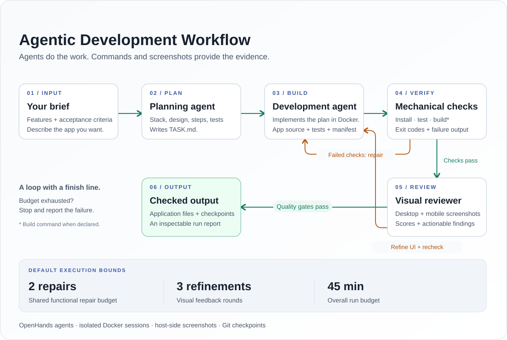

# Agentic Dev Engine

**Describe an app. Let agents build it. Check the result with code and screenshots.**

A local Python engine that coordinates OpenHands agents, isolated Docker workspaces,
automated checks, and visual review. It takes an application brief through planning,
implementation, verification, and bounded repair, leaving behind application files,
Git checkpoints, and a report you can inspect.



## The development loop

The planner turns your brief into `TASK.md`: a stack, implementation steps, design
direction, and acceptance criteria. A development agent implements the plan inside
a Docker workspace. The engine then runs the application's declared checks and
feeds real failures back into development.

Once those checks pass, Chrome captures desktop and mobile screenshots. A dedicated
reviewer assesses the interface and returns structured findings. Visual changes go
through functional verification again, so a design refinement still has to pass
the application's checks.

## What the engine handles

| Capability | What it does |
| --- | --- |
| **Plan before implementation** | Produces a task document with features, design direction, acceptance criteria, and a testing approach. |
| **Run actual checks** | Executes declared install and test commands, plus a build command when provided; captures exit codes and failure output. |
| **Repair failures** | Sends the failing command and its output back to development, with a shared limit on repair attempts. |
| **Review the interface** | Captures desktop/mobile screenshots and layout metrics when Playwright is available; the reviewer scores the result and records concrete findings. |
| **Refine and recheck** | Feeds visual feedback into another development round, then repeats functional checks. |
| **Leave a trail** | Creates application-local Git checkpoints and Markdown reports containing check results, review findings, and errors. |
| **Resume deliberately** | Reuses an existing workspace only when explicitly requested. Optional Codex CLI fallback can recover failed or inactive agent sessions. |

## Under the hood

The CLI drives a stateful development loop in [`runner.py`](src/autodev/runner.py).
OpenHands SDK `Conversation` manages the planning, development, and review agents.
Agent and verification phases use Docker sessions with loopback-bound control ports, while screenshot
capture runs on the host against a local preview of the built application.

The application directory is mounted for agent writes. Subscription credentials
use a separate temporary mount when needed, and OpenHands conversation state stays
inside the disposable container. Generated application source is checkpointed
without dependency folders, screenshots, or agent runtime state.

Each generated application declares its install, test, and optional build commands
in `.autodev/verification.json`. The engine executes those commands and checks
their exit codes. Install and test are required, and the generated README must
document its test command. Screenshot review expects a built web application in
`dist/`.

### Quality gates and stop conditions

By default, a run has **two functional repairs**, **three visual refinement rounds**,
and a **45-minute overall budget**. Visual acceptance requires:

- Overall score **at least 8/10**.
- Every design dimension **at least 7/10**.
- No medium- or high-severity findings.
- A production-ready assessment from the reviewer.

The dimensions cover hierarchy, composition, coherence, task-flow UX,
responsiveness, and product character. A failed gate ends in a failure report when
its retry budget is exhausted. These bounds are configurable in
[`.env.example`](.env.example); CLI fallback is disabled by default.

## Try it locally

Use Python 3.12 or 3.13 with `uv`. Live runs also need Docker, Git, a subscription
login, Chrome/Chromium, and the generated app's build tools, typically Node.js/npm.

```bash
uv sync
uv run autodev test
uv run autodev login
uv run autodev verify-install
uv run autodev run-live --confirm
```

`autodev test` runs the offline suite. The final command starts a live run.
Supply your own brief with:

```bash
uv run autodev run-live --requirement-file requirement.txt --confirm
```

<details>
<summary>Plan only, resume a workspace, and configure a run</summary>

Generate a plan without implementing the application:

```bash
uv run autodev plan --requirement-file requirement.txt
```

Resume an existing generated workspace:

```bash
uv run autodev run-live --workspace generated-apps/my-app --resume --confirm
```

Copy `.env.example` to `.env` for optional configuration overrides. `.env` is
ignored by Git. Live runs require `--confirm`; non-empty workspaces require
explicit resumption and are never reset or deleted by the runner.

</details>

## Find your way around

| Path | Responsibility |
| --- | --- |
| [`src/autodev/runner.py`](src/autodev/runner.py) | Agent orchestration, verification, repair, visual QA, fallback, checkpoints, and reporting. |
| [`src/autodev/workspace.py`](src/autodev/workspace.py) | Docker lifecycle, loopback networking, mounts, and permission normalization. |
| [`src/autodev/config.py`](src/autodev/config.py) | Configuration validation and execution limits. |
| [`src/autodev/cli.py`](src/autodev/cli.py) | Login, installation checks, planning, live runs, and offline tests. |
| [`tests/`](tests/) | Offline coverage for configuration and the development loop. |
| `generated-apps/` | Local generated applications and their own Git histories. |
| `reports/` | Local Markdown run reports and execution logs. |
